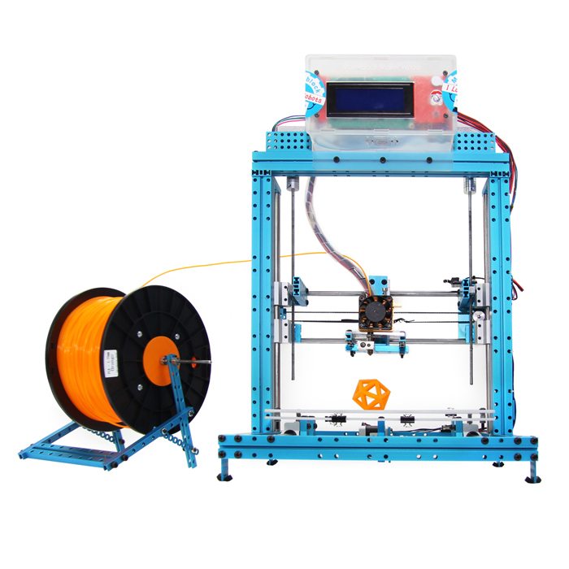

[ Library v2.1.0422](https://www.Makeblock.cc)

[ Makeblock Construtor I 3D printer Kit](https://www.Makeblock.cc)

The package consists of the software(Printrun-Win-Slic3r-10Mar2014),the firmware Marlin, some 3D models for testing and the structure assembly instruction.

